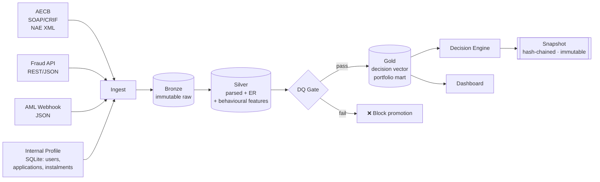

# Credit Decision Pipeline — Demo

> Unified data pipeline for three credit products (Personal Finance, BNPL, Credit Card Alternative) with four disparate data sources, built around a medallion architecture, cross-source identity resolution, and an immutable audit trail.

This repo is a working end-to-end demo. It generates fake data, runs it through a full bronze→silver→gold→decision→snapshot pipeline via a custom DAG runner, and exposes a Streamlit dashboard. All four core requirements from the brief are implemented with real code, not stubs.

---

## Quick start

The repo ships with a committed 50-customer sample dataset in `data/sample/`.
After setup, just run — no data generation step needed.

Pick one of the four setup paths below.

### 🐍 Option 1 — venv (macOS / Linux)

```bash
./setup.sh          # creates .venv and installs dependencies
./run.sh            # runs the pipeline
./run.sh dashboard  # same + launches the Streamlit UI
./run.sh test       # runs the test suite
```

### 🪟 Option 2 — venv (Windows PowerShell)

```powershell
Set-ExecutionPolicy -Scope Process -ExecutionPolicy Bypass   # once per session
.\setup.ps1
.\run.ps1
.\run.ps1 dashboard
```

### 🟢 Option 3 — conda (any OS)

```bash
conda env create -f environment.yml
conda activate credit-pipeline-demo
python run.py
streamlit run dashboard/app.py
```

### ⚡ Option 4 — plain pip (any OS, no scripts)

```bash
pip install -r requirements.txt
python run.py
streamlit run dashboard/app.py       # optional — launches the UI
pytest                               # optional — runs the test suite
```

---

A clean run against the 50-customer sample takes ~5 seconds and produces 150 decisions
(50 customers × 3 products) with full audit trails.

To test with more volume:

```bash
python -m src.data_generation.generate --customers 500 --output data/sample
python run.py
```

---

## Architecture at a glance



Full architecture document: [`architecture.md`](architecture.md)

---

## Data sources

| Source | Format | Key |
|---|---|---|
| **AECB** | SOAP envelope with CRIF NAE response XML | Emirates ID |
| **Internal Profile** | SQLite DB with 3 tables: `users`, `applications`, `instalments` | Emirates ID (from `users`) |
| **Fraud** | JSON | Emirates ID |
| **AML** | JSON (webhook callbacks) | Emirates ID |

### AECB fields extracted

From the real `soap:Envelope → MGResponse → NAE_RES` structure:

- Identity: `EmiratesId`, `FullNameEN`, `DOB` (DDMMYYYY → ISO), `Nationality`, `CBSubjectId`
- Score: `Score.Data.Index`, `Score.Data.Range`, `PaymentOrderFlag`
- Risk signals: count + total amount of severity-1 payment orders (bounced cheques)
- Court cases: total, open (status ≠ 90), total claim amount
- Employment: latest actual gross annual income

A real sample XML lives at `docs/aecb_sample.xml` and is parsed correctly by the tests.

### Behavioural features

Derived from the profile database with a single SQL join:

| Feature | SQL |
|---|---|
| `is_new_user` | `users` with no matching row in `applications` |
| `had_overdue_before` | any past `instalments` with status `OVERDUE` or `PAID_LATE` |

These flow through the decision vector and are used by rule packs.

---

## What's in here

| Area | Module | Highlight |
|---|---|---|
| **Orchestration** | `src/orchestration/` | Custom ~200-line DAG runner: topological sort, retries, upstream-failure skipping, persisted run history |
| **Data generation** | `src/data_generation/` | 500 customers, realistic AECB SOAP/CRIF XML, 9 kinds of injected messiness |
| **Bronze** | `src/bronze/` | Content-addressed immutable landing, provenance envelope per record, idempotent re-runs |
| **Silver** | `src/silver/` | Real AECB XML parser + 3 other source parsers + **4-tier entity resolver** + conflict log |
| **Data quality** | `src/dq/` | Declarative `Rule` framework, 8 rules, **gate that blocks gold promotion on must-pass breach** |
| **Gold** | `src/gold/` | `decision_input_vector` + portfolio star schema in SQLite |
| **Decision** | `src/decision/` | 3 product rule packs (v1.1.0) using real AECB signals + behavioural features |
| **Audit** | `src/audit/` | **Hash-chained snapshots** + content-addressed feature vectors + chain verification + deterministic replay |
| **Dashboard** | `dashboard/` | 3-page Streamlit: portfolio, DQ, decision lookup & audit |
| **Tests** | `tests/` | 54 tests: ER tiers, DQ rules, DAG runner, snapshot chain, AECB parser (real XML), behavioural features |

---

## Four focus areas

### 1. Entity resolution

Emirates ID is the universal key; everything else is a fallback for the edges.

```
Incoming record
    │
    ├─▶ Tier 1: Emirates ID valid & known?    → conf 1.00
    │
    ├─▶ Tier 2: phone + email match profile?  → conf 0.95, backfill EID
    │
    ├─▶ Tier 3: name + DOB fuzzy ≥ 0.92?      → conf ≥ 0.92, backfill EID
    │
    └─▶ Quarantine (human review)
```

Fraud and AML sources **cannot mint new canonical customers** — they can only attach to existing ones. This prevents a noisy fraud provider from creating phantom records. When a fallback tier resolves a record, the matched Emirates ID is written back onto the silver row so downstream joins always use the primary key.

Conflict precedence (when sources disagree on the same field): see `src/silver/conflict_log.py`. Losing values are persisted verbatim so auditors can reconstruct what was overridden.

### 2. Audit trail / snapshot chain

Every decision writes two immutable artifacts:

1. **Feature vector** at `data/audit/feature_vectors/<sha256[:2]>/<sha256>.json` — content-addressed, so identical vectors deduplicate and any byte change is detectable.
2. **Snapshot** at `data/audit/snapshots/dt=YYYY-MM-DD/product=.../dcn_....json` — links to the vector hash, the inputs, the decision, and the **previous snapshot's hash** for that product.

```
snapshot_N.prev_snapshot_sha256  ≡  snapshot_{N-1}.this_snapshot_sha256
```

Result: a tamper-evident chain per product. `verify_chain()` walks every snapshot in order and flags:

- `hash_mismatch` — stored hash ≠ recomputed hash (body was modified)
- `chain_break` — prev-pointer doesn't match previous snapshot (insert/delete/reorder)
- `vector_mismatch` — feature vector file's content doesn't hash to its stored hash

Tested: `tests/test_snapshot_chain.py` modifies a snapshot by a single byte and confirms the check fires.

### 3. Data quality framework

Rules are declarative — one class per rule, registered in `RULES`:

```python
class EidFormatRule(Rule):
    rule_id = "eid_format"
    severity = MUST_PASS
    source = "profile"
    description = "Emirates ID must match 784-YYYY-NNNNNNN-C."

    def check(self, context):
        ...
```

**MUST_PASS** rules tolerate zero fails. A breach fails the `dq_gate` task, which **blocks every gold task downstream**. **WARN** rules have per-rule thresholds and are logged but don't block.

Every run persists full results to `serving.db → dq_result`. The dashboard renders the latest scorecard.

### 4. Production-grade orchestration

A ~200-line DAG runner in `src/orchestration/dag.py` implements the parts that actually matter:

| Concept | Implementation |
|---|---|
| Task declaration | `Task(task_id, fn, upstream=[...], retries=N)` |
| Execution order | Kahn's topological sort |
| Cycle detection | Raises on construction |
| Upstream failure | Downstream tasks auto-skip, not retry |
| Retries | Per-task, configurable |
| Run history | `orchestration.db` — every DAG run, every task attempt, duration, errors |
| Context | Shared dict threaded through tasks |

The `credit_pipeline` DAG:

```
bronze_land
    └─► silver_parse
            ├─► silver_entity_resolution  ──► dq_scorecard ──► dq_gate ──┐
            └─► silver_conflict_log                                      │
                                       ┌─────────────────────────────────┘
                                       ├─► gold_decision_vector ─► decision_and_snapshot ─► chain_verify
                                       └─► gold_portfolio_mart
```

Tasks map 1:1 to Airflow `PythonOperators` — lifting to real Airflow requires no rewrite.

---

## Sample run output

```
▶ DAG 'credit_pipeline' starting — run_id=run_20260417_215507_6ac517
  ▸ bronze_land                    landed 513 files (503 unique)         ✅ 3.49s
  ▸ silver_parse                   profile=500 aecb=510 fraud=500 aml=485 ✅ 0.64s
  ▸ silver_entity_resolution       links=1995 quarantine=0 [eid=1970 fuzzy=25] ✅ 0.04s
  ▸ silver_conflict_log            conflicts=97                          ✅ 0.02s
  ▸ dq_scorecard                   ran 8 rules — 0 fail, 0 warn          ✅ 0.04s
  ▸ dq_gate                        all must-pass rules clean             ✅ 0.00s
  ▸ gold_decision_vector           built 1500 vectors                    ✅ 0.14s
  ▸ gold_portfolio_mart            customers=500                         ✅ 0.01s
  ▸ decision_and_snapshot          decisions=1500 approve=475 decline=682 refer=343 ✅ 23.3s
  ▸ chain_verify                   audit chain intact                    ✅ 1.76s

✅ DAG 'credit_pipeline' finished: success
```

Test suite:
```
54 passed in 1.41s
```

---

## What's demo vs production

| Layer | Demo | Production would add |
|---|---|---|
| Ingest | Local files in `data/landing/` | SFTP listeners, webhook HTTP endpoint with DLQ, Postgres logical replication |
| Storage | Local files + SQLite | S3 (Object Lock Compliance) + RDS Postgres |
| Orchestration | Custom DAG runner | Airflow / MWAA |
| Entity resolution | Deterministic + fuzzy | Plus ML-based matching for the hardest residual cases |
| Encryption | Filesystem only | Server-side encryption + tokenisation of PII at silver |
| Monitoring | Run history in SQLite | CloudWatch + on-call alerts on DQ breaches + chain alarms |
| Scale | 500 customers / 30s run | 100K decisions/day, 12-month runway |

None of these require architectural changes — they're straightforward extensions of the patterns in place.

---

## Project structure

```
credit-pipeline-demo/
├── README.md                          ← you are here
├── architecture.md                    ← short architecture doc
├── docs/
│   ├── design_decisions.md            ← 15 non-obvious choices
│   └── aecb_sample.xml                ← real AECB response sample
├── Makefile                           ← one-command workflow
├── setup.sh / setup.ps1               ← venv bootstrap (macOS/Linux / Windows)
├── run.sh   / run.ps1                 ← one-command runner (macOS/Linux / Windows)
├── environment.yml                    ← conda alternative
├── requirements.txt
├── pyproject.toml
├── run.py                             ← DAG entry point
├── src/
│   ├── config.py                      ← central paths, thresholds, versions
│   ├── models.py                      ← pydantic schemas for every layer
│   ├── orchestration/                 ← DAG runner + registry
│   ├── data_generation/               ← fake data generator (incl. real AECB format)
│   ├── bronze/                        ← immutable raw landing
│   ├── silver/                        ← parsers + entity resolution + conflict log
│   ├── dq/                            ← rule framework + gate
│   ├── gold/                          ← decision vector + portfolio mart
│   ├── decision/                      ← engine + 3 rule packs
│   └── audit/                         ← snapshot writer + replay
├── dashboard/
│   └── app.py                         ← Streamlit: 3 pages
└── tests/                             ← 54 tests
```

---

## License

MIT.
