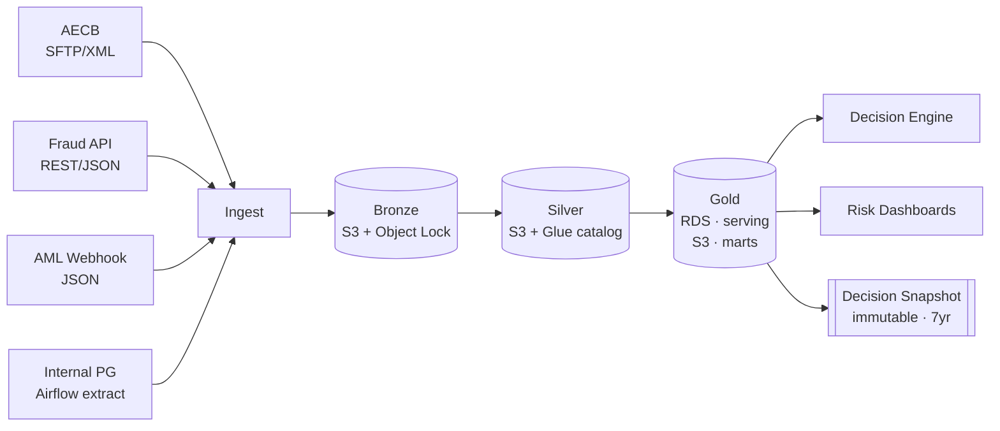
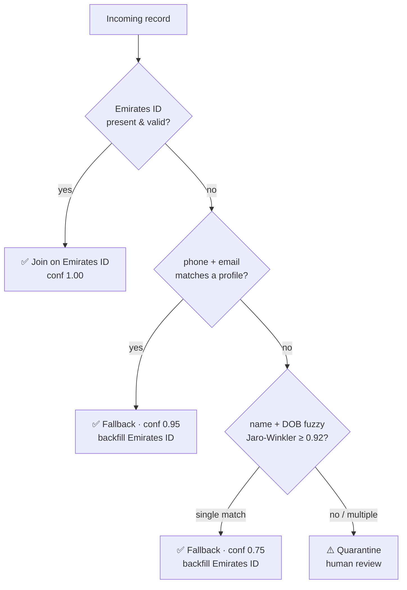
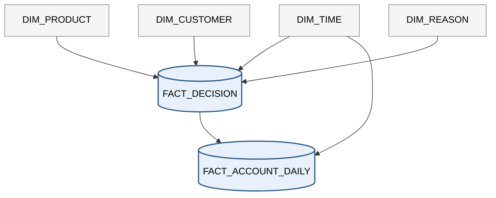

# Credit Decision Pipeline — Architecture

## 1. High-Level Flow

---

## 2. Medallion Layers

| Layer | Purpose | Storage | Key Contents |
|---|---|---|---|
| **Bronze** | Raw, immutable landing zone | S3 + Object Lock, partitioned by `source/ingest_date` | Verbatim payloads + provenance envelope (source, received_at, content hash) |
| **Silver** | Schematised + identity-resolved | S3 (Parquet) + Glue catalog | `aecb_credit_report`, `fraud_score`, `aml_screening`, `customer_profile` (SCD2), `entity_resolution_link` |
| **Gold** | Business-ready, served | RDS (serving) + S3 (analytical marts) | `decision_input_vector`, `decision_snapshot`, `portfolio_mart`, `dq_scorecard` |

Orchestration: Airflow for scheduled jobs (AECB pulls, internal Postgres extracts, silver→gold builds), Glue for the transform jobs themselves.

Promotion rule: a record only moves Bronze → Silver → Gold after passing must-pass data quality rules and successful entity resolution.

---

## 3. Entity Resolution

**Approach:** Emirates ID is the universal key. It is captured at KYC for every customer and passed as a reference identifier on every outbound call (fraud, AML) and every inbound feed (AECB). The internal profile maps `internal_uuid ↔ emirates_id` 1:1, and every Silver record carries both.

Native source keys (phone+email, name+DOB, internal UUID) are kept for traceability but serve as **fallback** only when Emirates ID is missing or malformed — e.g. a pre-KYC fraud pre-check or a delayed AML callback.

Whenever a fallback tier resolves a record, the matched Emirates ID is **written back** onto the Silver row so subsequent joins use the primary key.

**Conflict precedence** when sources disagree on the same field:

| Field | Winner | Why |
|---|---|---|
| Emirates ID | AECB | Bureau is authoritative |
| Phone / Email | Internal Profile | Customer updates it directly |
| Name / DOB | Profile → AECB | KYC-verified first |
| Credit data | AECB | Sole source |
| Fraud score | Fraud provider | Sole source |
| PEP / sanctions | AML provider | Sole source |

Losing values are logged so auditors can reconstruct the disagreement.

---

## 4. Portfolio Mart

Star schema: two facts sharing common dimensions.

`FACT_DECISION` holds one row per credit decision; `FACT_ACCOUNT_DAILY` holds one row per open account per day (for delinquency and exposure metrics). `DIM_TIME` is shared.

Drives approval-rate, decline-reason, vintage-delinquency, and exposure dashboards. The risk team sees aggregated numbers only — customer names, Emirates IDs, and phone numbers are hidden by default. Specific people can request temporary access to see real customer details (for regulator inquiries or fraud investigations), with manager approval and full logging.

---

## 5. Security & Encryption

All personal data is encrypted at every stage:

| Where | How |
|---|---|
| **In transit** | TLS 1.2+ on every connection (SFTP to AECB, REST to fraud/AML, Postgres client connections) |
| **At rest — S3** | Server-side encryption with customer-managed keys, one key per data class (bronze_raw, silver_pii, snapshots) |
| **At rest — RDS** | Storage encryption enabled + TLS for client connections |
| **Sensitive fields** | Emirates ID, phone, email tokenised on the way into Silver; raw values stay only in Bronze |

Key access is role-based and audit-logged. All data stays inside a UAE AWS region (no cross-border replication).

---

## 6. 30 / 60 / 90 Plan

| Phase | Focus | What we build |
|---|---|---|
| **Days 0–30** | Setup | Set up AWS · start receiving data from all 4 sources · save raw copies |
| **Days 31–60** | Core pipeline | Clean the data · link customers across sources · build the table the decision engine reads · save a copy of every decision |
| **Days 61–90** | Get ready to launch | Build risk dashboards · test with real users · run a test at 3× expected traffic · go live |
| **After launch** | Improvements | Smarter customer matching · faster data checks · let the business query data themselves · add a second credit bureau |

Everything in the first 90 days must be done before go-live. Items after launch make the system better but are not blockers.

---

*v1.0 · Data Platform & Credit Risk Engineering*
